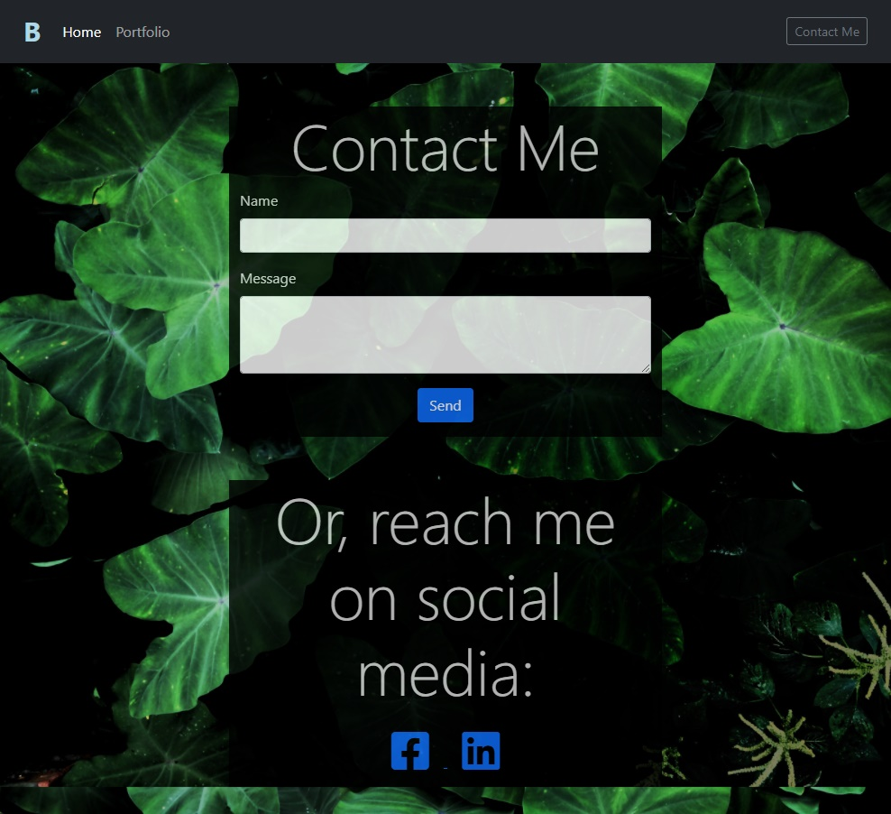

# billy-mk.github.io

Portfolio Website

The purpose of this project was to develop a website which will serve as my portfolio. While it only consists of three pages at the moment, with very few projects, over time this will develop into a full-fledged website. 

For now, this website has some information about me as well as a basic design. It utilizes Bootstrap, Fontawesome, and a custom CSS file. It makes use of the Bootstrap grid system to stay organized and responsive at all screen sizes.

There is certainly room for improvement. The Contact Me page has a button to send a message which doesn't work at the moment, since we haven't learned how to do something like that outside of 'mailto', which I would prefer not to use. 

However, I think I have the basic outline of a functional website, and a solid baseline from which to work as I progress through the UCD Web Development Boot Camp.

Link to webpage: billy-mk.github.io

## Images:

```md




## Credits

Bootstrap - https://getbootstrap.com/

FontAwesome https://fontawesome.com/